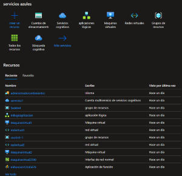

# Seguridad en la nube

## Microsoft Defender for cloud

- **Modelo de Servicion:** SaaS.
- **Funcion:** Ves el nivel de seguridad de los servicios.
- **Funcion:** Da recomendacion de seguridad.
- **Funcion:** Puede aplicar automaticamente configuracion de seguridad.
- **Cuando usar:** Analizar posibles ataques entrantes.

-------------------------------------------------------------------------------

## Azure Sentinel

Nos ayuda a detectar peuqeñas fallas o huecos, nos ayuda sobre todo a administrar los eventos de seguridad.

- **Modelo de Servicion:** SaaS.
- **Funcion:** Solucion SIEM y SOAR* Seguridad.

- SIEM: Recopila los datos de seguridad de todo,realizar analizis y buscar anomalias de esos datos.

- SOAR: Lo que hace es desencadenar flujos de trabajo, lo que hace es actuar, hace ejecucion de tareas de forma automatica.

- **Funcion:** Recopila a escala de nube.
- **Funcion:** Detecta amenazas que antes no se detectaban.
- **Funcion:** Investiga amenazas con inteligencia artificial.
- **Cuando usar:** siempre.

------------------------------------------------------------------

## primera practica Azure Sentinel.

1.- vamos al [Portal Azure](portal.azure.com).

2.- Buscamos Microsoft Sentinel.

3.- Le damos crear y despues le damos en crear un area de trabajo, para que asi registre todos los datos .

4.- Llenamos los datos como siempre y le damos en crear.

6.- Esperamos a que se cree nuestra area de trabajo.

7.- Seleccionamos nuestra area de trabajo y le damos en agregar.

8.- Entramos dentro de nuestra zona de trabajo. Nos vamos a la seccion que dice **MITRE ATY&CK**, que nos mostrara todos los posibles ataques.

Con esto, podemos saber un poco en forma teorica sobre ciber-seguridad

Uno de los ataques en especial son los discipulos de exploit por que son indetectables.

9.- Listo.

-------------------------------------------------------------------
